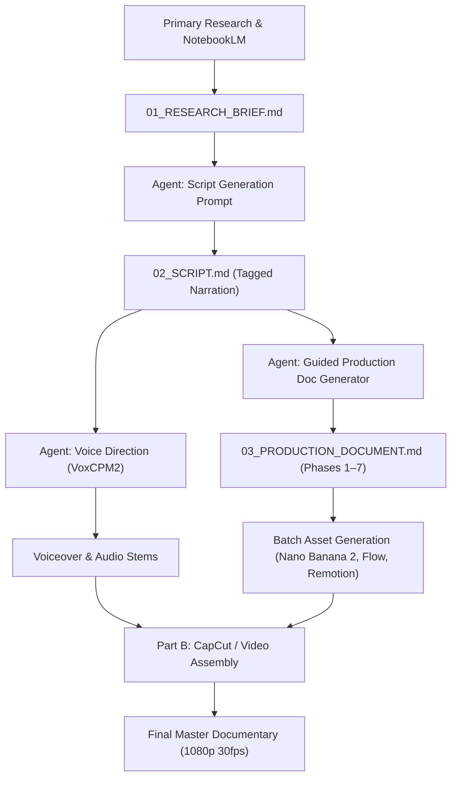

# FinanceCraft — Video Production Engine

An autonomous, end-to-end production framework for producing high-retention, investigative business and financial documentaries. 

FinanceCraft transforms primary-source research (SEC EDGAR filings, court records, congressional testimony, and forensic audits) into compelling, cinematic video essays built within a tactile **illustrated paper-cutout diorama** aesthetic.

---

## 📁 Repository Architecture

This repository is organized as a modular multi-video engine. The root contains the master editorial and production guidelines, while each episode lives in its own self-contained directory under `videos/`.

```text
YT Videos/ (Repository Root)
│
├── README.md                                                 # This Guide & Workflow Manual
├── FinanceCraft — Channel Bible, Asset Guide & Description.md # Master Channel Bible & Engine Specification
├── FinanceCraft — Channel Bible, Asset Guide & Description.docx # Reference Word Document
├── .gitignore                                                # Excludes OS caches, temporary renders, etc.
│
└── videos/                                                   # Episode Workspace
    │
    ├── _template/                                            # Reusable starter scaffold for new episodes
    │   ├── 01_RESEARCH_BRIEF.md                              # [Input] Research analysis & evidentiary spine
    │   ├── 02_SCRIPT.md                                      # [Deliverable] Tagged narration script
    │   ├── 03_PRODUCTION_DOCUMENT.md                         # [Deliverable] 7-phase production document
    │   ├── assets/                                           # Stills, AI video clips, motion graphics, maps
    │   └── voiceover/                                        # VO stems, narrator cuts, and sound beds
    │
    └── 01-peloton-collapse/                                  # Complete Reference Project
        ├── PELOTON_COLLAPSE_PRODUCTION_DOCUMENT.md           # Full 60-beat production breakdown (Markdown)
        ├── FinanceCraft — Peloton Collapse Production Document.docx # Formatted production document
        ├── peloton-collapse-narration-script.pdf             # Original narration script
        └── peloton_script_text.txt                           # Raw script transcript
```

---

## ⚡ How the Engine Works

The FinanceCraft engine expects a single starting input from the creator: **a detailed research analysis / brief**. From that point forward, the AI agent (e.g. Antigravity, Claude, or ChatGPT) reads [`FinanceCraft — Channel Bible, Asset Guide & Description.md`](file:///Users/bilalashraf/YT%20Videos/FinanceCraft%20%E2%80%94%20Channel%20Bible,%20Asset%20Guide%20&%20Description.md) to generate all downstream production assets.



---

## 🚀 Step-by-Step Workflow Guide

### Step 1: Initialize a New Video Project
Create a new directory under `videos/` using the starter template:
```bash
cp -r "videos/_template" "videos/<episode-name>"
```
*(Example: `videos/02-wirecard-scandal`)*

---

### Step 2: Upload Your Research Analysis (`01_RESEARCH_BRIEF.md`)
The engine operates strictly on primary-source verification. Fill out `01_RESEARCH_BRIEF.md` using the research methodology detailed in the Master Bible (Section: *Research Methodology for NotebookLM*):
- **Angle Statement**: The single counter-intuitive insight that differentiates this video.
- **The Gap List**: Specific facts contradicting or absent from mainstream coverage.
- **The Pivotal Detail**: The single most load-bearing document or quote.
- **Key Figures**: Names, roles, and moral framing (Accountability Caricature vs. Victim Silhouette).
- **Verified Timeline & Citations**: Direct references to SEC filings, court dockets, or official audits.
- **Narrative-Mining Highlights**: Direct spoken quotes, ironic statements, and striking numbers.
- **Showable Assets**: Real physical artifacts to appear on screen (tweets, 10-K snippets, exhibits).

---

### Step 3: Generate the Tagged Narration Script (`02_SCRIPT.md`)
Feed `01_RESEARCH_BRIEF.md` into the AI coding agent with the **Script Generation Prompt** from the Channel Bible.

**Agent Action Checklist:**
1. Selects an intentional non-chronological narrative structure (*In medias res*, *Investigation frame*, *Ticking clock*, *Parallel arcs*, etc.) with a 1-sentence rationale.
2. Crafts the high-retention opening hook (targeting the first 3 seconds).
3. Writes spoken-pace narration (~155 words/minute, 12–15 minute target runtime).
4. Inserts mandatory inline asset and delivery tags:
   - `[SHOWABLE: <description>]` for real document props
   - `[PIVOTAL]` for the central load-bearing revelation
   - `[MAP: <location/route>]` for geographical staging
   - `[CARICATURE: <name>]` for accountability targets
   - `[DATA: <metric/chart>]` for financial visualizations
   - Spoken energy shifts: `[TENSE]`, `[WRY]`, `[SOMBER]`, `[BUILDING]`, `[STILLNESS]`

Save the completed script as `videos/<episode-name>/02_SCRIPT.md`.

---

### Step 4: Run Voice Direction (`voiceover/`)
Apply the **Voice Direction Prompt (VoxCPM2)** from the Channel Bible to the tagged script:
- Generates precise vocal style prompts, cadence controls, and emotional inflection blocks.
- Outputs audio generation stems into the `voiceover/` folder.
- Standards: 24-bit 48kHz WAV, normalized to -16 LUFS.

---

### Step 5: Generate the 7-Phase Production Document (`03_PRODUCTION_DOCUMENT.md`)
Run the **Guided Production Document Generator** against the tagged script. This runs in strict sequential order:

1. **Phase 1: Titles & Description** — 5 categorized title candidates + full YouTube description with SEO tags and primary source citations.
2. **Phase 2: Thumbnail Concepts** — 3 distinct paper-diorama concepts with high contrast, focal simplicity, and prompt text.
3. **Phase 3: Character Setup** — Fixed reference blocks for recurring caricatures to prevent AI drift.
4. **Phase 4: Beat-by-Beat Production Plan** — Granular beat table linking voiceover lines, visual types, camera movements, prompts, and sound design.
5. **Phase 6: Consolidated Batches** — Grouped execution deliverables:
   - *Batch 1*: Nano Banana 2 Stills (4K, 3840×2160, 16:9)
   - *Batch 2*: Google Flow / Omni AI Video Clips (1080p, 16:9, muted/silent prompt)
   - *Batch 3*: Real Document & Evidence Props (scanned/cut paper)
   - *Batch 4*: Remotion Code Components (data graphics, animated charts, maps)
   - *Batch 5*: Voiceover & Sound Effects
6. **Phase 6: Shorts Spinoffs** — 3–4 vertical (9:16) short-form derivative concepts for NotebookLM Video Overview.
7. **Phase 7: Part B — Editing & Assembly Guide** — CapCut timeline structure, track assignments, and parallax transition rules.

Save the output as `videos/<episode-name>/03_PRODUCTION_DOCUMENT.md`.

---

### Step 6: Asset Generation & Tool Inventory
Execute the consolidated prompt batches using the recommended tool stack:

| Asset Type | Tool / Engine | Resolution | Notes |
| :--- | :--- | :--- | :--- |
| **Static Backgrounds / Dioramas** | Nano Banana 2 (or equivalent) | 3840×2160 (4K, 16:9) | 2x headroom for CapCut pan/zoom & parallax |
| **Performance AI Video** | Google Flow / Omni (or equivalent) | 1920×1080 (16:9) | 6–8s clips; must include `mute/no audio` prompt flag |
| **Animated Motion Graphics & Maps** | Remotion / React | 1920×1080 (30fps) | Code-driven kinetic typography, financial charts, routes |
| **Background Music Bed** | Suno / Udio | 44.1kHz Stereo | Single thematic instrumental score (-18dB to -24dB under VO) |
| **Voiceover** | VoxCPM2 | 48kHz WAV | -16 LUFS, documentary pacing |
| **Timeline Assembly** | CapCut (via CapCut MCP or manual) | 1920×1080 (30fps) | Multi-layer paper diorama staging |

---

## 🎨 Creative & Editorial Rules

1. **The Visual System (One Register, One Exception)**:
   - *Primary Register*: Tactile paper-cutout diorama world. Layered paper textures, torn edges, physical paper-fiber grain, and subtle drop shadows.
   - *The One Exception*: Real evidence as physical paper props. Actual SEC filings, tweets, court orders, and photographs appear as physical cutouts taped or glued into the collage. Never use AI to recreate a fake document.
2. **Caricature & Legal Guardrails**:
   - Caricatures are strictly for wrongdoers facing consequences.
   - Victims, crew members, and bystanders use anonymized paper silhouettes with factual labels.
   - Never generate lip-synced or scripted mouth animations for real living figures. Quotes appear on styled paper quote cards.
3. **No Unexplained Jargon**:
   - Every financial term (covenants, write-downs, EBITDA adjustments) is explained in plain spoken language immediately upon introduction.

---

## 🤖 Prompting an AI Agent (Antigravity / Coding Assistant)

When working with Antigravity or any agent in this repository, you can use these quick instructions:

### For Script Generation:
> *"Read `FinanceCraft — Channel Bible, Asset Guide & Description.md` (Script Generation Prompt section) and `videos/<episode>/01_RESEARCH_BRIEF.md`. Generate `videos/<episode>/02_SCRIPT.md` following all structural rules and inline asset tagging."*

### For Production Document Generation:
> *"Read `FinanceCraft — Channel Bible, Asset Guide & Description.md` (Guided Production Document Generator section) and `videos/<episode>/02_SCRIPT.md`. Generate `videos/<episode>/03_PRODUCTION_DOCUMENT.md` following Phases 1 through 7."*

### For Remotion Graphics:
> *"Check the Remotion Prompt Guidelines in `FinanceCraft — Channel Bible, Asset Guide & Description.md` and generate the motion graphic components for Beat [X] in `videos/<episode>/assets/`."*

---

## 📦 Pushing to GitHub

This repository is pre-configured and clean for version control:
```bash
git init
git add .
git commit -m "Initialize FinanceCraft Video Production Engine"
git branch -M main
git remote add origin <your-github-repo-url>
git push -u origin main
```
